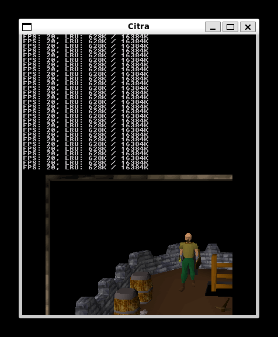
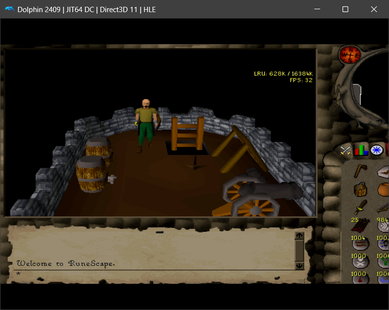
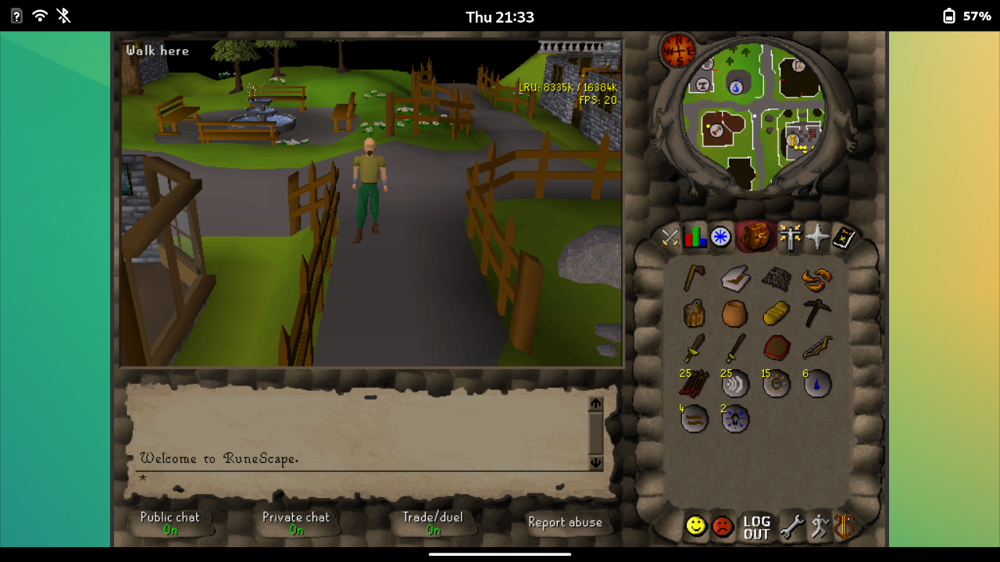

## TODO
```
add diskstore/gzip just for later cache loading
SDL3 is not officially released yet, need updated binaries when it is.
icon etc for the different platforms: title+taskbar+desktop
http requests for checksums/cache (not done as they aren't supposed to change and saving files on consoles depends on if sdcard or romfs was used)
change a bunch of functions and function prototypes to static
clientstream is based off rsc-c, double check it for accuracy
the following are (partially) based on RS2-225 by accident, some funcs might take args in diff order to Client repo: animbase, animframe, pix2d, pix3d, gameshell, jagfile, model, packet, pix8, pixfont, pixmap. Rewrite maybe?
inconsistent naming: used both world3d and scene for world3d, rename world3d to scene? or at least for args only
global search TODO and NOTE
add CI: check both highmem/lowmem, members/free, all entrypoints, run make check/scan/san and clang-format
```
## Java and C differences + codestyle
```
- errorhost, errorstarted and errorloading code never runs
- no pound character as it doesn't fit in ascii
- window insets removed, (gameframe/viewbox).java replaced with platform dir
- added pix error checking in client_load
- java static class members are added to a separate global struct
- java private static class members are now C global static vars
- for stack allocated arrays/strings we have to check if idx[0] != '\0'
- original unused vars/params casted to (void) to avoid spam with warnings on
- some input (EG client_update_title username/password) is changed to fit C better
- some buffer sizes used are just arbitrary due there not being a strict limit
- try catch turned into if (!var) break in load() or goto is used for login error message
- init() moved to main() as that's emscriptens entrypoint

- networking/midi/login flames run on the same thread
- synchronized is unused and there's no run() function in client.c
- can't create threads on web without sharedarraybuffer if we wanted to: https://emscripten.org/docs/porting/pthreads.html
- c11 threads aren't supported with sanitizers, valgrind tools, tcc and macos
- no official pthreads on windows, the thirdparty one dropped old windows support?

- int is assumed to be 32 bits, the few uses of shorts are ignored
- use int8_t for java byte arrays, char isn't guaranteed to be signed
- use in64_t for longs, size_t for stdlib calls, uints are used for interacting with libs
- long is 32 bits on windows, int64_t is used for packet, size_t otherwise
- *.length checks replaced with *_count vars (EG label_vertices) or *_LENGTH define if it doesn't change
- replaced labelled break/continue with goto
- removed explicit null checks with with var and !var
- prefixed function names with the struct they take as first arg
- signed integer underflow/overflow is undefined (-fwrapv doesn't exist for cl/tcc, but there's no known issue) loopcycle should be ok

- msvc doesn't support VLAs (variable length arrays), use heap allocations
- changed camelCase into snake_case, lowercase hex values
- no code width limit as virtual text wrapping is superior for selecting complete lines
- only moved files to dirs with little includes to avoid complicating builds with -I
```
